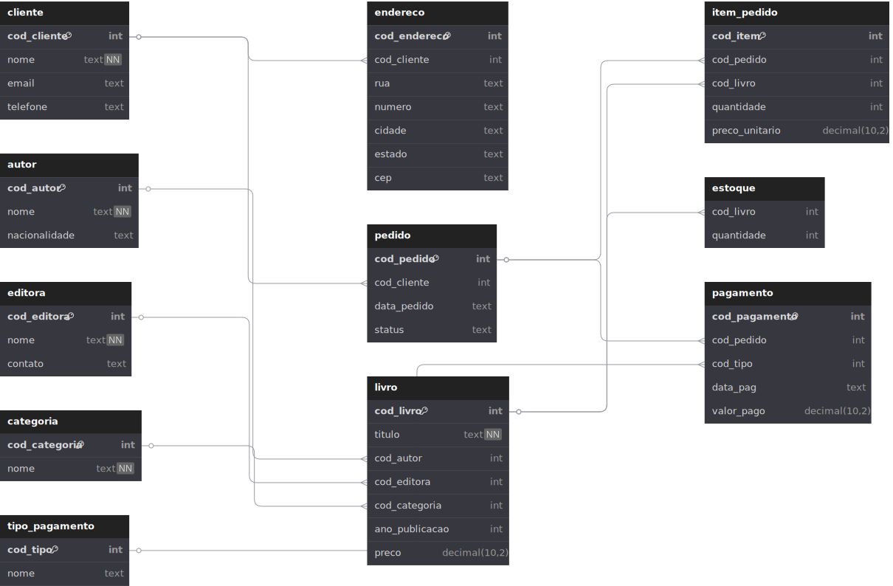

### 🧱 Estrutura das Tabelas

Abaixo, alguns detalhes importantes sobre as principais tabelas do modelo:

#### 📄 `cliente`

* Armazena os dados básicos dos clientes.
* Campos obrigatórios: `cod_cliente`, `nome`
* Campo `email` é **único** para garantir que não existam duplicatas.

#### 🏠 `endereco`

* Endereços relacionados a clientes.
* Cada endereço possui um `cod_cliente` referenciando a tabela `cliente`.

#### ✍️ `autor`

* Informações sobre os autores dos livros.
* Campo `nome` é obrigatório.

#### 🏢 `editora`

* Informações sobre editoras.
* Utilizada como chave estrangeira na tabela `livro`.

#### 📚 `livro`

* Detalhes dos livros disponíveis no sistema.
* Relaciona-se com `autor`, `editora` e `categoria`.
* Possui campo `preco` do tipo `decimal(10,2)`.

#### 🏷️ `categoria`

* Classifica os livros em categorias temáticas (ex: Romance, Técnico, Infantil...).

#### 🏬 `estoque`

* Responsável por controlar a quantidade de cada livro disponível.
* Cada registro de estoque está ligado a um `cod_livro`.

#### 🛒 `pedido`

* Representa as compras feitas por um cliente.
* Contém data (`data_pedido`) e status (ex: “Pago”, “Pendente”).

#### 💳 `tipo_pagamento`

* Define os tipos de pagamento disponíveis (ex: Cartão, Boleto, Pix...).

#### 🧾 `pagamento`

* Relaciona um pagamento a um pedido e a um tipo de pagamento.
* Inclui data de pagamento e valor pago.

#### 📦 `item_pedido`

* Detalha os livros comprados em cada pedido.
* Cada item possui quantidade e preço unitário.
* Relaciona-se com `pedido` e `livro`.

---

### 🔗 Relacionamentos

O modelo segue o paradigma **relacional** com uso de **chaves estrangeiras** para garantir integridade referencial. Exemplos:

* `endereco.cod_cliente` → `cliente.cod_cliente`
* `livro.cod_autor` → `autor.cod_autor`
* `pagamento.cod_pedido` → `pedido.cod_pedido`
* `item_pedido.cod_livro` → `livro.cod_livro`

Esses relacionamentos asseguram consistência entre os dados e facilitam operações como `JOIN` para geração de relatórios ou dashboards.

---

### 🛠️ Ferramenta usada

* [dbdiagram.io](https://dbdiagram.io): Ferramenta online para visualização e modelagem de banco de dados via linguagem DBML.

---

